# Practical Work 2 - Graphical Converter Application (MAUI)

## Table of Contents
- [Introduction](#introduction)  
- [UML Diagram](#uml-diagram)  
- [Project Description](#project-description)  
- [Application Flow](#application-flow)  
- [Problems Encountered](#problems-encountered)  

---

## Introduction

This project is a graphical application to perform conversions between different representations (binary, decimal, hexadecimal, octal, two's complement) developed with .NET and MAUI. The app has a basic and intuitive user management system that allows registration, login, password recovery and shows the history of operations.

---

### Class Diagram

```mermaid
classDiagram
    class User {
        -string Name
        -string Username
        -string Password
        -int OperationCount
        +static User FromCsv(string csvLine)
        +string ToCsv()
    }

    class Conversion {
        -string Name
        -string Definition
        +Conversion(string name, string definition)
        +abstract string Change(string input)
    }

    class DecimalToBinary {
        +override string Change(string input)
    }

    class DecimalToTwoComplement {
        -int size
        +SetSize(int size)
        +override string Change(string input)
        +override string Change(string input, int bits)
    }

    class BinaryToDecimal {
        +override string Change(string input)
    }

    class ConverterWrapper {
        +static string DecimalToBinary(string input)
        +static string DecimalToTwoComplement(string input, int bits)
        +static string BinaryToDecimal(string input)
        +static string DecimalToOctal(string input)
        +static string DecimalToHexadecimal(string input)
        +static string TwoComplementToDecimal(string input)
        +static string OctalToDecimal(string input)
        +static string HexadecimalToDecimal(string input)
    }

    class ConversorPage {
        -Entry inputEntry
        -Entry bitsEntry
        -Label resultLabel
        +void OnConvertClicked(object sender, EventArgs e)
        +void OnKeypadClicked(object sender, EventArgs e)
        +void OnClearClicked(object sender, EventArgs e)
        +void IncrementOperationCount()
        +void SaveOperation(string username, string input, string bits, string operationType, string output)
    }

    class OperationsPage {
        -Label nameLabel
        -Label usernameLabel
        -Label passwordLabel
        -Label operationsLabel
        -VerticalStackLayout operationsContainer
        +void LoadUserData()
        +void OnBackClicked(object sender, EventArgs e)
        +void OnLogoutClicked(object sender, EventArgs e)
        +void OnExitClicked(object sender, EventArgs e)
    }

    class LoginPage {
        -Entry usernameEntry
        -Entry passwordEntry
        +void OnLoginClicked(object sender, EventArgs e)
        +void OnRegisterClicked(object sender, EventArgs e)
        +void OnForgotPasswordClicked(object sender, EventArgs e)
    }

    class RegisterPage {
        +void OnRegisterClicked(object sender, EventArgs e)
    }

    class RecoverPasswordPage {
        +void OnRecoverClicked(object sender, EventArgs e)
    }


```

---

## Project Description

### Main functionalities

- The User class represents the users with their attributes and executed operations.
- The Conversion class defines the interface for the different conversion types.
- Converter acts as a manager that provides the available operations and executes them.
- The GUI has pages for Login, Registration, Recovery, Converter and Operations, which interact with the logic classes.

---

## Application Flow

1. The user starts on the login page.  
2. you can access registration or recovery if necessary.  
3. After logging in, you access the Converter page, where you enters a value and selects the conversion.  
4. The result appears in the same input box.  
5. Each operation is saved in the history linked to the user.  
6. The user can navigate to the Operations page to view his information and the complete history.  
7. The user can logout or exit from the Operations page.  
- The User class represents the users with their attributes and executed operations.  
- The Conversion class defines the interface for the different types of conversion.    
- Converter acts as a manager that provides the available operations and executes them.  
- The graphical interface has pages for Login, Registration, Recovery, Converter and Operations, which interact with the logical classes.

---

## Problems Encountered

- Real-time history management presented difficulties due to continuous reading and writing of CSV files.  
- Initial problems with paths in Shell navigation and dynamic page loading.
- Coordination between the graphical interface and the logic so that the result is displayed in the same text box. Easily solved after code analysis.
- Many problems with maui installation and configuration.
- Keeping the user session active during the flow of the program, having the users already created even if the user closes the app, and handling the logout correctly required spending time to organize the csv files and the logic.
---

  
https://github.com/nicoguzman12/oop_pw1_ext_2425

---

 Nicolás Guzman Bastida, 2025 UFV  

